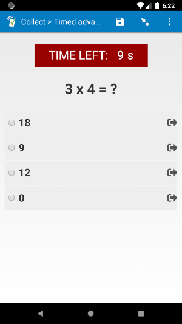
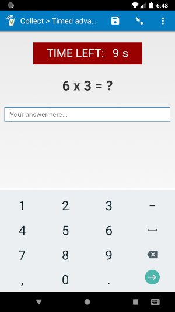
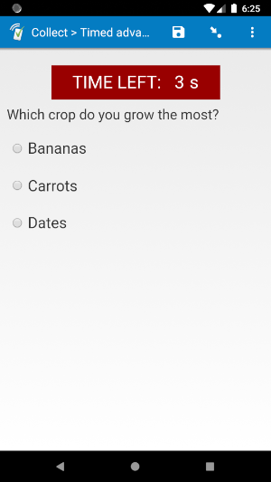
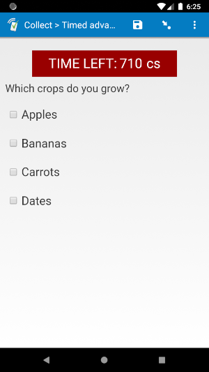

# Timed advance

  
*select_one* with "quick" *appearance*

| numeric | select_one | select_multiple |
| --- | --- | --- |
|  |  |  |

## Description

This field plug-in makes a field auto-advance to the next screen after a configurable period of time has passed. A countdown of remaining time is displayed on screen.

If a user attempts to return to a field with this field plug-in that has already been completed, the field will auto-advance (unless parameter 4 is equal to `1` and there was time left, see **Parameters** below).

See supported field types below.

## Default SurveyCTO feature support

| Feature / Property | Support |
| --- | --- |
| Supported field type(s) | `text`, `integer`, `decimal`, `select_one`, `select_multiple`|
| Default values | Yes |
| Custom constraint message | Yes |
| Custom required message | Yes |
| Read only | No |
| media:image | Yes |
| media:audio | Yes |
| media:video | Yes |
| `numbers` appearance | Yes (`text` only) |
| `numbers_decimal` appearance | Yes (`text` only) |
| `numbers_phone` appearance | Yes (`text` only) |
| `show_formatted` appearance | Yes (`text`, `integer`, and `decimal` only) |
| `quick` appearance | Yes (`select_one` only) |
| `minimal` appearance | No |
| `compact` appearance | No |
| `compact-#` appearance | No |
| `quickcompact` appearance | No |
| `quickcompact-#` appearance | No |

## How to use

**To use this field plug-in as-is**, just download the [timedadvance.fieldplugin.zip](timedadvance.fieldplugin.zip) file from this repo, and attach it to your form.

To create your own field plug-in using this as a template, follow these steps:

1. Fork this repo
1. Make changes to the files in the `source` directory.

    * **Note:** be sure to update the `manifest.json` file as well.

1. Zip the updated contents of the `source` directory.
1. Rename the .zip file to *yourpluginname*.fieldplugin.zip (replace *yourpluginname* with the name you want to use for your field plug-in).
1. You may then attach your new .fieldplugin.zip file to your form as normal.

**Important:** When using on a `select_one` or `select_multiple` field, you need to include a choice with the value of `-99`. This choice will be hidden by the field plug-in, but it will be selected if the time runs out without a choice selected.

## Parameters
There are four parameters, but all of them are optional:
|**Number**|**Name**|**Description**|**Default**|
|---|---|---|---|
|1.|`duration`|Time in seconds before the field auto-advances. No matter what unit is used for parameter 2, you should always enter the duration in seconds.|`10`|
|2.|`unit`|Unit to be displayed for the time remaining. The time will be shown as the correct converted version. For example, if the start time is 15 seconds, and the unit is `'ms'` for milliseconds, the time will be displayed at the start as `15000`.|`'s'`|
|3.|`pass`|The value the field will be given if time runs out before an answer is given.|`-99`|
|4.|`continue`|Whether a respondent can return to a field and continue with the time they have left. For example, if there was 5 seconds remaining when they swiped forward, they can return to that field and work with that remaining 5 seconds. To allow this, give this parameter a value of `1`.|`0`|

For parameter 2, you can use the following display units:

|**Abbr.**|**Full name**|**Unit in 1 second**|
|:---|:---|:---|
|`s`|seconds|1
|`ds`|deciseconds|10
|`cs`|centiseconds|100
|`ms`|milliseconds|1000

For example, if you would like the field to move forward after 20 seconds, you can use this *appearance*:

    timedadvance(duration=20)

If you would like the time to be displayed in milliseconds, you can use this *appearance*:

    timedadvance(duration=20, unit='ms')

If the field is of type *select_one*, you would like it to have the `quick` appearance, and the field should last 15 seconds, you can use this *appearance*:

    quick timedadvance(duration=15)

If you would like the respondent to have 15 seconds to complete the field, but they can return to it later to change their answer with their remaining time, you can use this *appearance*:

    quick timedadvance(duration=15, unit='s', pass=-99, continue=1)

## More resources

* **Test form**  
You can find a form definition in this repo here: [extras/test-form](extras/test-form).

* **Developer documentation**  
More instructions for developing and using field plug-ins can be found here: [https://github.com/surveycto/Field-plug-in-resources](https://github.com/surveycto/Field-plug-in-resources)
